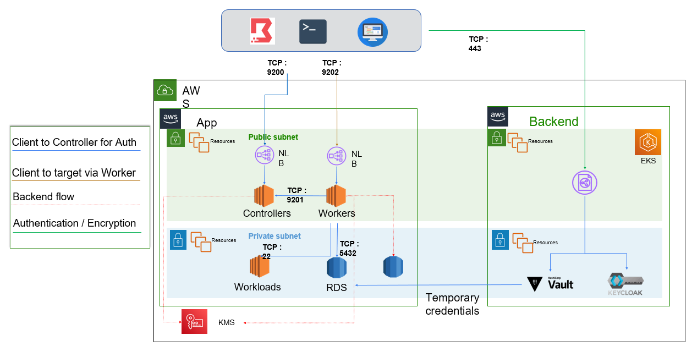

# Boundary Deployment Examples
This directory contains two deployment examples for Boundary using Terraform. The `aws/` directory contains an example AWS reference architecture codified in Terraform. The `boundary/` directory contains an example Terraform configuration for Boundary using the [Boundary Terraform Provider](https://github.com/hashicorp/terraform-provider-boundary).

## Reference


## Requirements
- Terraform 1.1.5
- Go 1.15 or later 
- AWS EKS cluster

# Deploy EKS cluster and components
[EKS Cluster](./eks-v2/)


# Deploy boundary
The folder "SCRIPTS" contain all script, to permit you to validate boundary deployment on AWS platform

To deploy this example:
- Make sure you have a local checkout of `github.com/hashicorp/boundary`
- Build the `boundary` binary for linux using `XC_OSARCH=linux/amd64 make dev` or download from our [release page](https://boundaryproject.io/) on our docs site.
- In the `example` directory, run 

```
terraform apply -target module.aws -var boundary_bin=<path to your binary>
```

If your public SSH key you want to SSH to these hosts are not located at `~/.ssh/id_rsa.pub` then you'll also need to override that value:
```
terraform apply -target module.aws -var boundary_bin=<path to your binary> -var pub_ssh_key_path=<path to your SSH public key>
```

If the private key is not named the same as the public key but without the .pub suffix and/or is not stored in the same directory, you can use the `priv_ssh_key_path` variable also to point to its location; otherwise its filename will be inferred from the filename of the public key.

## Verify
- Once your AWS infra is live, you can SSH to your workers and controllers and see their configuration:
  - `ssh ubuntu@<controller-ip>`
  - `sudo systemctl status boundary-controller`
  - For workers, the systemd unit is called `boundary-worker`
  - The admin console will be available at `https://boundary-test-controller-<random_name>-<random_sha>.elb.us-east-1.amazonaws.com:9200`

## Configure Boundary 
cd boundary

- Configure tfvarts.vars to complete somes variables
  - KMS key
  - ISSUER (keycloak)
  - VAULT URL
  - VAULT TOKEN

- Configure boundary using `terraform apply --var-file=tfvarts.vars` (without the target flag), this will configure boundary per `boundary/main.tf`

## Login


- Open the console in a browser and login to the instance using one of the `backend_users` defined in the main.tf (or, if you saved the output from deploying the aws module, use the output from the init script for the default username/password)
- Find your org, then project, then targets. Save the ID of the target. 
- Find your auth methods, and save the auth method ID.
- Login on the CLI: 

```
BOUNDARY_ADDR='https://boundary-test-controller-<random_name>-<some sha>.elb.us-east-1.amazonaws.com:9200' \
  boundary authenticate password \
  -login-name=jim \
  -password foofoofoo \
  -auth-method-id=ampw_<some ID>
```

You can also use this login name in the Boundary console that you navigated to in the verify step.

## Connect

Connect to the target in the private subnet via Boundary:

```
BOUNDARY_ADDR='http://boundary-test-controller-<random_name>-<sha>.elb.us-east-1.amazonaws.com:9200' \
  boundary connect ssh --username ubuntu -target-id ttcp_<generated_id>
```


## Connect

./authenticate-boundary-paul.sh
export BOUNDARY_TOKEN=....
export BOUNDARY_ADDR=http://boundary-t-controller-werewolf-2945817b2d73f929.elb.us-east-1.amazonaws.com:9200
boundary targets  list -scope-id p_77ktiPxXBK
boundary connect ssh --username ubuntu -target-id ttcp_fHadyP2HxC

# Encrypt boundary credentiual on VAULT
Ref : https://registry.terraform.io/providers/hashicorp/boundary/latest/docs/resources/credential_library_vault

## Encrypt password on VAULT
vault token create \
  -no-default-policy=true \
  -policy="boundary-controller" \
  -policy="boundary-pwd" \
  -orphan=true \
  -period=20m \
  -renewable=true

Solution 1 : 
add token on variables.tf file, variable : vault-token
Execute terraform
```
terraform plan && terraform apply
```

Solution 2 : 
Complete the tfvars.tf file

```
terraform plan --var-file=tfvars.vars
terraform apply --var-file=tfvars.vars
```
